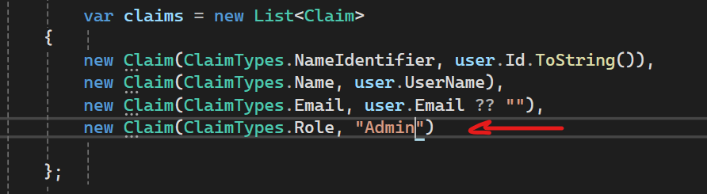
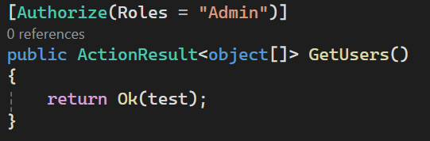

# What is it?  
> Role-Based Authorization restricts access to parts of your application based on the **roles** assigned to a user (e.g., Admin, User, Manager). It helps enforce security by allowing only users with specific roles to perform certain actions.

> **==*Built in supported*
> By default: The Role is a claim, So the attribute will check the claims if contains this rol.
> Internally working a policy based

# common roles used across various systems:

---

### 🔒 **1. Administrator (Admin)**

- **Permissions:** Full access to all system features.    
- **Typical Use:** Managing users, settings, data, permissions.    
- **Example:** Website super admin, system administrator.    

---

### 👤 **User (or End User)**

- **Permissions:** Limited access to their own data or basic functions.    
- **Typical Use:** Regular users interacting with the system.    
- **Example:** A customer using an e-commerce site.    

---

### 🧑‍💼 **Manager (or Supervisor)**

- **Permissions:** Access to their team’s or department’s data.    
- **Typical Use:** Approving requests, viewing reports.    
- **Example:** HR manager, sales manager.    

---

### 🛠️ **Editor (or Content Creator)**

- **Permissions:** Create and modify content, but limited administrative control.    
- **Typical Use:** Publishing blog posts, editing website pages.    
- **Example:** Marketing team updating site content.    

---

### 👀 **Viewer (or Read-Only)**

- **Permissions:** Read access only, no editing or deletion.    
- **Typical Use:** Reports, audits, monitoring.    
- **Example:** Stakeholder viewing analytics dashboard.    

---

### 📦 **Contributor**

- **Permissions:** Can add or suggest content but not publish or manage users.    
- **Typical Use:** Submitting articles, product suggestions.    
- **Example:** Guest blogger or junior team member.    

---

### 🧾 **Auditor**

- **Permissions:** Access to logs, reports, and audit trails.    
- **Typical Use:** Compliance, security review.    
- **Example:** Internal/external compliance officers.    

---

### ⚙️ **Support (or Helpdesk)**

- **Permissions:** Can assist users, reset passwords, or view issue tickets.    
- **Typical Use:** Customer support or tech support.    
- **Example:** IT support staff.
# Authorization Implementation:
## ✅ Basic Implementation: 
The role in the authorization is a claim, so in the controller the API will take the role from the attribute by default, for example: 

Controller:  
```
 [Authorize(Roles = "Admin")]
 public ActionResult<object[]> GetUsers()
 {
     return Ok(test);
 }
```
In this example the GetUsers API will check the role claim and make sure if it contains the Asmin role.
```
[Authorize(Roles = "Admin, Manager")]
```
this is means if the user should have Admin or Manager role

```
 [Authorize(Roles = "Admin,")]
[Authorize(Roles = "Manager,")]
```

This is means if the user should have Admin and Manager role

## ✅ Advanced Implementation: 
### ✅ Step 1: Create the `RoleEntity` and the linking table `UserRoleEntity`

Update a `RoleEntity` and a many-to-many relationship with `UserEntity` through `UserRoleEntity`.

Here's the code:

```
public class RoleEntity
{
    public ICollection<UserRoleEntity> UserRoles { get; set; } = new List<UserRoleEntity>();
}
```

```
public class UserRoleEntity
{
    public int RoleId { get; set; }
    public RoleEntity Role { get; set; }
}
```


### ✅ Step 2: Seed initial roles in the database (e.g., Admin, User)

We’ll seed the `Roles` table with a few default roles.

#### 👉 Add seeding logic

🧱 Step 2.1: Create a `DbSeeder` class
In your `Authentication.Infrastructure` project, create a new file:

📄 `DbSeeder.cs`
```
using Authentication.Infrastructure;
using Authentication.Business.Entities;

namespace Authentication.Infrastructure.Seeding;

public static class DbSeeder
{
    public static async Task SeedRolesAsync(AppDbContext context)
    {
        if (!context.Roles.Any())
        {
            var roles = new List<RoleEntity>
            {
                new RoleEntity { Name = "Admin" },
                new RoleEntity { Name = "User" }
            };

            context.Roles.AddRange(roles);
            await context.SaveChangesAsync();
        }
    }
}

```
> ✅ This checks if roles exist, and if not, adds "Admin" and "User".

#### 🧱 Step 2.2: Call the seeder in `Program.cs` (in the Users API)

In your **Users API Project**, go to `Program.cs`, and **after building the app**, add:

```
using (var scope = app.Services.CreateScope())
{
    var context = scope.ServiceProvider.GetRequiredService<AppDbContext>();
    await DbSeeder.SeedRolesAsync(context);
}
```

> Add this **after** `var app = builder.Build();`

### ✅ Step 3: Assign Roles to Users and Enforce Role-Based Authorization

---

#### 🧱 Step 3.1: Add `UserRoleEntity` relationship in `UserEntity` and `RoleEntity`

You already have this in your `UserEntity`:

```
`public ICollection<UserRoleEntity> UserRoles { get; set; }`
```

Make sure `RoleEntity` also has:

```
`public ICollection<UserRoleEntity> UserRoles { get; set; }`
```

---

#### 🧱 Step 3.2: Create the `UserRoleEntity`

If not done yet, create `UserRoleEntity.cs` inside your `Business.Entities` folder:
```
namespace Authentication.Business.Entities;

public class UserRoleEntity
{
    public int UserId { get; set; }
    public UserEntity User { get; set; }

    public int RoleId { get; set; }
    public RoleEntity Role { get; set; }
}
```
#### 🧱 Step 3.3: Update your `AppDbContext` for UserRoles

Add to your `AppDbContext`:
```
public DbSet<UserRoleEntity> UserRoles { get; set; }

protected override void OnModelCreating(ModelBuilder modelBuilder)
{
    base.OnModelCreating(modelBuilder);

    modelBuilder.Entity<UserRoleEntity>()
        .HasKey(ur => new { ur.UserId, ur.RoleId });

    modelBuilder.Entity<UserRoleEntity>()
        .HasOne(ur => ur.User)
        .WithMany(u => u.UserRoles)
        .HasForeignKey(ur => ur.UserId);

    modelBuilder.Entity<UserRoleEntity>()
        .HasOne(ur => ur.Role)
        .WithMany(r => r.UserRoles)
        .HasForeignKey(ur => ur.RoleId);
}
```
#### 🧱 Step 3.4: Assign roles to users when registering

In your `UserService.RegisterUserAsync` (or wherever you create users), add logic to assign a role (e.g., "User") to the new user.
Example snippet:

```
var userRole = await _context.Roles.SingleOrDefaultAsync(r => r.Name == "User");

if (userRole == null)
    throw new Exception("Role not found");

var userRoleEntity = new UserRoleEntity
{
    User = newUser,
    Role = userRole
};

_context.UserRoles.Add(userRoleEntity);
await _context.SaveChangesAsync();
```


### ✅ Step 4: Controller: 



