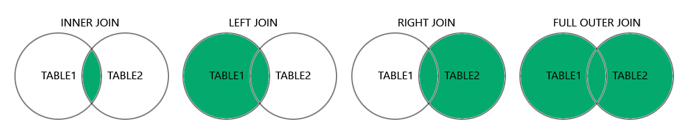

# SQL (Structured Query Language)

## 📌 Definition
**SQL (Structured Query Language)** is a standard programming language used to **manage and manipulate relational databases (RDBMS)**.  
It allows you to **create, read, update, and delete (CRUD)** data, define database schemas, and manage permissions.

---

## 🔑 Key Features
- **Standard Language for RDBMS** (works with MySQL, Oracle, SQL Server, PostgreSQL, etc.).
- **Data Querying**: Retrieve data using `SELECT` queries.
- **Data Manipulation**: Insert, update, and delete records.
- **Schema Definition**: Create and alter tables.
- **Access Control**: Manage permissions and roles.
- **Transaction Control**: Commit or roll back changes.
- Supports **relationships between tables** using **primary and foreign keys**.

---

## 🗂 SQL Categories

SQL commands are divided into the following categories:
### 1️⃣ **DDL (Data Definition Language)**
Defines and manages database structures.
- `CREATE`: Create database objects (tables, views).
- `ALTER`: Modify existing objects.
- `DROP`: Delete objects.

Example:
```sql
CREATE TABLE Users (
    UserID INT PRIMARY KEY,
    Name VARCHAR(50),
    Email VARCHAR(100) UNIQUE
);
```

### 2️⃣ **DML (Data Manipulation Language)**

Handles data operations (CRUD).
- `INSERT`: Add records.    
- `UPDATE`: Modify existing records.    
- `DELETE`: Remove records.    

Example:

```
INSERT INTO Users (UserID, Name, Email)
VALUES (1, 'Alice', 'alice@email.com');

UPDATE Users SET Name = 'Alice Johnson' WHERE UserID = 1;
DELETE FROM Users WHERE UserID = 1;

```

---

### 3️⃣ **DQL (Data Query Language)**

Used for querying data.

- `SELECT`: Retrieve data from tables.

Example:

```
SELECT Name, Email FROM Users WHERE UserID = 1;
```

---

### 4️⃣ **DCL (Data Control Language)**

Controls permissions and security.
- `GRANT`: Give access.    
- `REVOKE`: Remove access.    

Example:

```
GRANT SELECT ON Users TO 'read_only_user';
REVOKE SELECT ON Users FROM 'read_only_user';
```

---

### 5️⃣ **TCL (Transaction Control Language)**

Manages database transactions.
- `COMMIT`: Save changes.    
- `ROLLBACK`: Undo changes.    
- `SAVEPOINT`: Create savepoints.    

Example:

```
BEGIN TRANSACTION;
UPDATE Users SET Email='alice@newmail.com' WHERE UserID=1;
ROLLBACK; -- Undo changes
```

---

## 🧩 SQL Relationships

SQL supports **relationships between tables**:
- **One-to-One**: Each record in one table relates to only one record in another.    
- **One-to-Many**: One record in one table relates to multiple records in another.    
- **Many-to-Many**: Managed via a junction table.    

Example:

```
-- Users Table
CREATE TABLE Users (
    UserID INT PRIMARY KEY,
    Name VARCHAR(50)
);

-- Orders Table (One-to-Many relationship)
CREATE TABLE Orders (
    OrderID INT PRIMARY KEY,
    UserID INT,
    Product VARCHAR(50),
    FOREIGN KEY (UserID) REFERENCES Users(UserID)
);
```

---

## 🛠 Common SQL Constraints

- `PRIMARY KEY`: Uniquely identifies each record.    
- `FOREIGN KEY`: Links records across tables.    
- `UNIQUE`: Prevents duplicate values.    
- `NOT NULL`: Ensures the field cannot be empty.    
- `CHECK`: Enforces a condition.    
- `DEFAULT`: Provides a default value.    

---

## 📄 Summary Syntax

```
-- Create Table
CREATE TABLE table_name (
    column1 datatype constraint,
    column2 datatype constraint
);

-- Insert Data
INSERT INTO table_name (col1, col2) VALUES (val1, val2);

-- Retrieve Data
SELECT col1, col2 FROM table_name WHERE condition;

-- Update Data
UPDATE table_name SET col1 = val1 WHERE condition;

-- Delete Data
DELETE FROM table_name WHERE condition;
```

---

# SQL Joins

## 📌 Definition
A **JOIN** in SQL is used to **combine rows from two or more tables** based on a related column (usually a **foreign key**).

---

## 🔑 Why Use Joins?
- To fetch related data stored in multiple tables.
- To normalize data and avoid redundancy.
- To represent **relationships** (one-to-many, many-to-many) between tables.

---

## 🧩 Types of Joins
> References: https://www.w3schools.com/sql/sql_join.asp

Here are the different types of the JOINs in SQL:

- `(INNER) JOIN`: Returns records that have matching values in both tables
- `LEFT (OUTER) JOIN`: Returns all records from the left table, and the matched records from the right table
- `RIGHT (OUTER) JOIN`: Returns all records from the right table, and the matched records from the left table
- `FULL (OUTER) JOIN`: Returns all records when there is a match in either left or right table

### 1️⃣ **INNER JOIN**
- Returns **only matching rows** between both tables.
- Non-matching rows are excluded.

**Syntax:**
```sql
SELECT A.column, B.column
FROM TableA AS A
INNER JOIN TableB AS B
ON A.id = B.a_id;
```

Let's look at a selection of the [**Products**](https://www.w3schools.com/sql/trysql.asp?filename=trysql_products) table:

|ProductID|ProductName|CategoryID|Price|
|---|---|---|---|
|1|Chais|1|18|
|2|Chang|1|19|
|3|Aniseed Syrup|2|10|

And a selection of the [**Categories**](https://www.w3schools.com/sql/trysql.asp?filename=trysql_categories) table:

|CategoryID|CategoryName|Description|
|---|---|---|
|1|Beverages|Soft drinks, coffees, teas, beers, and ales|
|2|Condiments|Sweet and savory sauces, relishes, spreads, and seasonings|
|3|Confections|Desserts, candies, and sweet breads|
We will join the Products table with the Categories table, by using the `CategoryID` field from both tables:

Example:
```
SELECT ProductID, ProductName, CategoryName  
FROM Products  
INNER JOIN Categories ON Products.CategoryID = Categories.CategoryID;
```
### Result:

| ProductID | ProductName                  | CategoryName |
| :-------- | :--------------------------- | :----------- |
| 2         | Chang                        | Beverages    |
| 1         | Chais                        | Beverages    |
| 4         | Chef Anton's Cajun Seasoning | Condiments   |
| 3         | Aniseed Syrup                | Condiments   |
### 2️⃣ **LEFT JOIN (or LEFT OUTER JOIN)**

- Returns **all rows from the left table**, and **matching rows from the right table**.    
- If no match, NULL is returned for the right table.
 **Note:** In some databases LEFT JOIN is called LEFT OUTER JOIN.
 
 LEFT JOIN Syntax:
```
SELECT _column_name(s)_  
FROM _table1_  
LEFT JOIN _table2  
_ON _table1.column_name_ = _table2.column_name_;
```
 
 Demo Database:
In this tutorial we will use the well-known Northwind sample database.

Below is a selection from the "Customers" table:

|CustomerID|CustomerName|ContactName|Address|City|PostalCode|Country|
|---|---|---|---|---|---|---|
|1|Alfreds Futterkiste|Maria Anders|Obere Str. 57|Berlin|12209|Germany|
|2|Ana Trujillo Emparedados y helados|Ana Trujillo|Avda. de la Constitución 2222|México D.F.|05021|Mexico|
|3|Antonio Moreno Taquería|Antonio Moreno|Mataderos 2312|México D.F.|05023|Mexico|

And a selection from the "Orders" table:

|OrderID|CustomerID|EmployeeID|OrderDate|ShipperID|
|---|---|---|---|---|
|10308|2|7|1996-09-18|3|
|10309|37|3|1996-09-19|1|
|10310|77|8|1996-09-20|2|

---

SQL LEFT JOIN Example:
The following SQL statement will select all customers, and any orders they might have:

 Example[Get your own SQL Server](https://www.w3schools.com/sql/sql_server.asp "W3Schools Spaces")
```
SELECT Customers.CustomerName, Orders.OrderID  
FROM Customers  
LEFT JOIN Orders ON Customers.CustomerID = Orders.CustomerID  
ORDER BY Customers.CustomerName;
```
**Note:** The `LEFT JOIN` keyword returns all records from the left table (Customers), even if there are no matches in the right table (Orders):

|CustomerName|OrderID|
|:--|:--|
|Alfreds Futterkiste||
|Ana Trujillo Emparedados y helados|10308|
|Antonio Moreno Taquería|10365|
### 3️⃣ **RIGHT JOIN (or RIGHT OUTER JOIN)**

- Opposite of LEFT JOIN.    
- Returns **all rows from the right table** and **matching rows from the left table**.    
- If no match, NULL is returned for the left table.
- 
 RIGHT JOIN Syntax:
```
SELECT _column_name(s)_  
FROM _table1_  
RIGHT JOIN _table2  
_ON _table1.column_name_ = _table2.column_name_;
```

**Note:** In some databases `RIGHT JOIN` is called `RIGHT OUTER JOIN`.

Demo Database:
In this tutorial we will use the well-known Northwind sample database.
Below is a selection from the "Orders" table:

|OrderID|CustomerID|EmployeeID|OrderDate|ShipperID|
|---|---|---|---|---|
|10308|2|7|1996-09-18|3|
|10309|37|3|1996-09-19|1|
|10310|77|8|1996-09-20|2|

And a selection from the "Employees" table:

|EmployeeID|LastName|FirstName|
|:--|:--|:--|
|3|Leverling|Janet|
|4|Peacock|Margaret|
|5|Buchanan|Steven|
|6|Suyama|Michael|
|7|King|Robert|
|8|Callahan|Laura|
SQL RIGHT JOIN Example
The following SQL statement will return all employees, and any orders they might have placed:

Example[Get your own SQL Server](https://www.w3schools.com/sql/sql_server.asp "W3Schools Spaces")
```
SELECT Orders.OrderID, Employees.LastName, Employees.FirstName  
FROM Orders  
RIGHT JOIN Employees ON Orders.EmployeeID = Employees.EmployeeID  
ORDER BY Orders.OrderID;
```
**Note:** The `RIGHT JOIN` keyword returns all records from the right table (Employees), even if there are no matches in the left table (Orders):

|OrderID|LastName|FirstName|
|:--|:--|:--|
||West|Adam|
|10248|Buchanan|Steven|
|10249|Suyama|Michael|
|10250|Peacock|Margaret|
|10251|Leverling|Janet|
|10252|Peacock|Margaret|
|10253|Leverling|Janet|
|10254|Buchanan|Steven|
|10255|Dodsworth|Anne|
### 4️⃣ **FULL OUTER JOIN**

- Combines the result of **LEFT JOIN and RIGHT JOIN**.    
- Returns **all rows from both tables**, with NULL where there is no match.    

FULL OUTER JOIN Syntax:
```
SELECT _column_name(s)_  
FROM _table1_  
FULL OUTER JOIN _table2  
_ON _table1.column_name_ = _table2.column_name_WHERE _condition_;
```
**Note:** `FULL OUTER JOIN` can potentially return very large result-sets!

	Demo Database
In this tutorial we will use the well-known Northwind sample database.
Below is a selection from the "Customers" table:

|CustomerID|CustomerName|ContactName|Address|City|PostalCode|Country|
|---|---|---|---|---|---|---|
|1|Alfreds Futterkiste|Maria Anders|Obere Str. 57|Berlin|12209|Germany|
|2|Ana Trujillo Emparedados y helados|Ana Trujillo|Avda. de la Constitución 2222|México D.F.|05021|Mexico|
|3|Antonio Moreno Taquería|Antonio Moreno|Mataderos 2312|México D.F.|05023|Mexico|

And a selection from the "Orders" table:

|OrderID|CustomerID|EmployeeID|OrderDate|ShipperID|
|---|---|---|---|---|
|10308|2|7|1996-09-18|3|
|10309|37|3|1996-09-19|1|
|10310|77|8|1996-09-20|2|

---
SQL FULL OUTER JOIN Example

The following SQL statement selects all customers, and all orders:
```
SELECT Customers.CustomerName, Orders.OrderID  
FROM Customers  
FULL OUTER JOIN Orders ON Customers.CustomerID=Orders.CustomerID  
ORDER BY Customers.CustomerName;
```
A selection from the result set may look like this:

| CustomerName                       | OrderID |
| ---------------------------------- | ------- |
| _Null_                             | 10309   |
| _Null_                             | 10310   |
| Alfreds Futterkiste                | _Null_  |
| Ana Trujillo Emparedados y helados | 10308   |
| Antonio Moreno Taquería            | _Null_  |
**Note:** The `FULL OUTER JOIN` keyword returns all matching records from both tables whether the other table matches or not. So, if there are rows in "Customers" that do not have matches in "Orders", or if there are rows in "Orders" that do not have matches in "Customers", those rows will be listed as well.

### 5️⃣ **SELF JOIN**

- A table joined with **itself**.    
- Useful for hierarchical data (e.g., employees & managers).

 Self Join Syntax:
```
SELECT _column_name(s)_  
FROM _table1 T1, table1 T2_  
WHERE _condition_;
```

_T1_ and _T2_ are different table aliases for the same table.

---

Demo Database

In this tutorial we will use the well-known Northwind sample database.
Below is a selection from the "Customers" table:

|CustomerID|CustomerName|ContactName|Address|City|PostalCode|Country|
|---|---|---|---|---|---|---|
|1|Alfreds Futterkiste|Maria Anders|Obere Str. 57|Berlin|12209|Germany|
|2|Ana Trujillo Emparedados y helados|Ana Trujillo|Avda. de la Constitución 2222|México D.F.|05021|Mexico|
|3|Antonio Moreno Taquería|Antonio Moreno|Mataderos 2312|México D.F.|05023|Mexico|

---

SQL Self Join Example
The following SQL statement matches customers that are from the same city:
Example[Get your own SQL Server](https://www.w3schools.com/sql/sql_server.asp "W3Schools Spaces"):
```
SELECT A.CustomerName AS CustomerName1, B.CustomerName AS CustomerName2, A.City  
FROM Customers A, Customers B  
WHERE A.CustomerID <> B.CustomerID  
AND A.City = B.City  
ORDER BY A.City;
```

| CustomerName1                  | CustomerName2                  | City         |
| :----------------------------- | :----------------------------- | :----------- |
| Océano Atlántico Ltda.         | Cactus Comidas para llevar     | Buenos Aires |
| Cactus Comidas para llevar     | Océano Atlántico Ltda.         | Buenos Aires |
| Rancho grande                  | Océano Atlántico Ltda.         | Buenos Aires |
| Rancho grande                  | Cactus Comidas para llevar     | Buenos Aires |
| Océano Atlántico Ltda.         | Rancho grande                  | Buenos Aires |
| Cactus Comidas para llevar     | Rancho grande                  | Buenos Aires |
| Princesa Isabel Vinhoss        | Furia Bacalhau e Frutos do Mar | Lisboa       |
| Furia Bacalhau e Frutos do Mar | Princesa Isabel Vinhoss        | Lisboa       |
### 6️⃣ **CROSS JOIN**

- Returns the **Cartesian product** of both tables (every row of A with every row of B).    
- No ON condition is used.    

**Syntax:**

```
SELECT A.column, B.column
FROM TableA AS A
CROSS JOIN TableB AS B;
```

**Example:**

```
SELECT Users.Name, Products.ProductName
FROM Users
CROSS JOIN Products;
```

**Result:**  
Every user will be paired with every product (use carefully!).

Demo Database
In this tutorial we will use the well-known Northwind sample database.
Below is a selection from the "Customers" table:

|CustomerID|CustomerName|ContactName|Address|City|PostalCode|Country|
|---|---|---|---|---|---|---|
|1|Alfreds Futterkiste|Maria Anders|Obere Str. 57|Berlin|12209|Germany|
|2|Ana Trujillo Emparedados y helados|Ana Trujillo|Avda. de la Constitución 2222|México D.F.|05021|Mexico|
|3|Antonio Moreno Taquería|Antonio Moreno|Mataderos 2312|México D.F.|05023|Mexico|

And a selection from the "Orders" table:

|OrderID|CustomerID|EmployeeID|OrderDate|ShipperID|
|---|---|---|---|---|
|10308|2|7|1996-09-18|3|
|10309|37|3|1996-09-19|1|
|10310|77|8|1996-09-20|2|

---

MySQL CROSS JOIN Example
The following SQL statement selects all customers, and all orders:
Example[Get your own SQL Server](https://www.w3schools.com/sql/sql_server.asp "W3Schools Spaces")
```
SELECT Customers.CustomerName, Orders.OrderID  
FROM Customers  
CROSS JOIN Orders;
```

|CustomerName|OrderID|
|:--|:--|
|Alfreds Futterkiste|10248|
|Ana Trujillo Emparedados y helados|10248|
|Antonio Moreno Taquería|10248|
|Around the Horn|10248|
|Berglunds snabbköp|10248|
|Blauer See Delikatessen|10248|
|Blondel père et fils|10248|
**Note:** The `CROSS JOIN` keyword returns all matching records from both tables whether the other table matches or not. So, if there are rows in "Customers" that do not have matches in "Orders", or if there are rows in "Orders" that do not have matches in "Customers", those rows will be listed as well.

# All SQL Syntax:
you can find them here: https://www.w3schools.com/mysql/default.asp