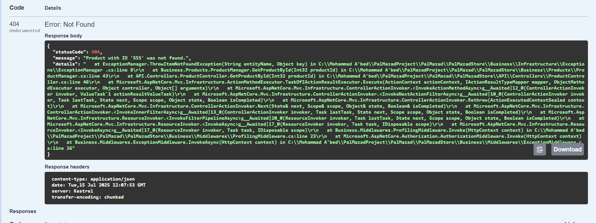
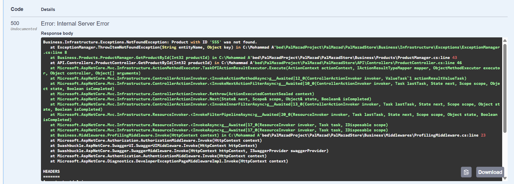

---

This document explains how to implement and organize clean, reusable, and professional exception handling in an ASP.NET Core project.

---
# Code & Structure:
## 🗂️ Folder Structure

```
/Business/Infrastructure
		  /Exceptions
		    - NotFoundException.cs
		    - ValidationException.cs (optional)
		    - ExceptionManager.cs
		    - ValidationMessages.cs
	/Middlewares
		- ExceptionMiddleware.cs
```

---

## 1️⃣ NotFoundException.cs

```
public class NotFoundException : Exception
{
    public string EntityName { get; }
    public object Key { get; }

    public NotFoundException(string entityName, object key)
        : base($"{entityName} with ID '{key}' was not found.")
    {
        EntityName = entityName;
        Key = key;
    }

    public NotFoundException(string entityName, object key, string customMessage)
        : base(customMessage)
    {
        EntityName = entityName;
        Key = key;
    }
}
```

---

## 2️⃣ ValidationException.cs (optional)

```
public class ValidationException : Exception
{
    public ValidationException(string message) : base(message) { }
}
```

---

## 3️⃣ ValidationMessages.cs

```
public static class ValidationMessages
{
    public static string GetNotFoundMessage(string entityName, string id) =>
        $"{entityName} with ID '{id}' was not found.";

    public static string GetAlreadyExistsMessage(string entityName, string value) =>
        $"{entityName} with value '{value}' already exists.";
}
```

---

## 4️⃣ ExceptionManager.cs

```
public static class ExceptionManager
{
    public static void ThrowItemNotFoundException(string entityName, object key)
    {
        var message = ValidationMessages.GetNotFoundMessage(entityName, key.ToString());
        throw new NotFoundException(entityName, key, message);
    }

    public static void ThrowValidationException(string field, string message)
    {
        throw new ValidationException($"Validation failed on field '{field}': {message}");
    }
}
```

---

## 5️⃣ ExceptionMiddleware.cs
### Why did we use `ExceptionMiddleware`?

- **Centralized error handling:** Instead of scattering try/catch blocks all over controllers and services, the middleware catches all unhandled exceptions in one place.    
- **Consistent API responses:** It formats errors into a consistent JSON structure (`statusCode`, `message`, `details`), so clients always get predictable error data.    
- **Simplifies code:** Your controller methods stay clean, focusing on business logic rather than error handling.    
- **Environment-aware:** Middleware can show detailed error info only in development, hiding sensitive details in production.    
- **Logging:** It provides a single spot to log all exceptions for monitoring and debugging.    

**Results with the middleware:**


---

### What happens if you remove `ExceptionMiddleware`?

- Exceptions will not be caught globally. They will bubble up and may cause the application to return generic error pages or stack traces depending on configuration.    
- Your API responses will become inconsistent — some might return plain error messages or HTML error pages instead of JSON.    
- You will need to add try/catch blocks everywhere to handle exceptions properly.    
- Logging and debugging become fragmented and harder to maintain.

**Results without the middleware:**


```
using Microsoft.AspNetCore.Http;
using Microsoft.Extensions.Logging;
using Microsoft.Extensions.Hosting;
using System.Text.Json;

public class ExceptionMiddleware
{
    private readonly RequestDelegate _next;
    private readonly ILogger<ExceptionMiddleware> _logger;
    private readonly IHostEnvironment _env;

    public ExceptionMiddleware(RequestDelegate next, ILogger<ExceptionMiddleware> logger, IHostEnvironment env)
    {
        _next = next;
        _logger = logger;
        _env = env;
    }

    public async Task InvokeAsync(HttpContext context)
    {
        try
        {
            await _next(context);
        }
        catch (Exception ex)
        {
            _logger.LogError(ex, ex.Message);
            await HandleExceptionAsync(context, ex);
        }
    }

    private async Task HandleExceptionAsync(HttpContext context, Exception exception)
    {
        context.Response.ContentType = "application/json";
        context.Response.StatusCode = exception switch
        {
            NotFoundException => StatusCodes.Status404NotFound,
            ValidationException => StatusCodes.Status400BadRequest,
            _ => StatusCodes.Status500InternalServerError
        };

        var response = new
        {
            statusCode = context.Response.StatusCode,
            message = exception.Message,
            details = _env.IsDevelopment() ? exception.StackTrace : null
        };

        await context.Response.WriteAsync(JsonSerializer.Serialize(response));
    }
}
```

---

## 6️⃣ Registering Middleware in `Program.cs`

```
app.UseMiddleware<ExceptionMiddleware>();
```

> ✅ Place this **before** `app.UseAuthorization()` and `app.MapControllers()`.

---

## 🧪 Example Usage

```
public async Task<Product> GetProductById(int productId)
{
    var product = await _context.Products.FindAsync(productId);
    if (product == null)
    {
        ExceptionManager.ThrowItemNotFoundException("Product", productId);
    }
    return product;
}
```

---

## 🧠 Debugging Tip (Important)

When debugging in Visual Studio, you might get a popup and breakpoint **even if the exception is handled**. This is controlled by:

### 👉 `Debug > Windows > Exception Settings`

- Disable "Break When Thrown" for your custom exception.    
- Or add it manually using `Ctrl + Alt + E`.
    

---

## ✅ Result Example in Postman or Swagger

```
{
  "statusCode": 404,
  "message": "Product with ID '1234' was not found.",
  "details": null
}
```

---

## 📌 Notes

- `IHostEnvironment` is used to detect the current environment (Development, Production...)    
- The exception handler ensures **clean, secure, and consistent** API error responses    
- Stack traces are hidden in production for security
    

---

## 📚 Optional Improvements

- Log exception types & correlation IDs    
- Return problem details using RFC 7807    
- Add localization support for error messages    

---
