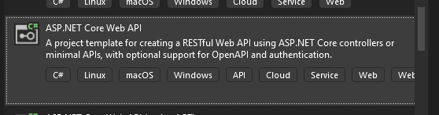

# Create new project:
 

# Program.cs:

The `Program.cs` file in an **ASP.NET Core** application is the **entry point** of the app. It sets up and starts the web host. So it's a bootstraps the application — it sets up the web server, registers services, configures the middleware pipeline, and starts the app.

### Key Responsibilities of `Program.cs`:

1. **Create the Host**: It configures and builds the web application host, which includes services, middleware, and configurations.
    
2. **Configure Services and Middleware**:
    
    - With the newer `.NET 6+` minimal hosting model, `Program.cs` includes both the **startup logic** and **middleware configuration**.
        
    - Example:
```
        var builder = WebApplication.CreateBuilder(args);
var app = builder.Build();

app.MapGet("/", () => "Hello World!");

app.Run();

```
        
3. **Dependency Injection**: Registers services like controllers, databases, logging, etc., into the **dependency injection (DI)** container.
    
4. **Middleware Pipeline**: Defines how requests are handled through middleware like routing, authentication, etc.
### Initial program.cs:
```
// Initializes the **web app builder** with default configurations (e.g., logging, configuration, etc.).
 var builder = WebApplication.CreateBuilder(args);

// Add services to the container.

builder.Services.AddControllers(); // adds support for **MVC-style controllers** (used for APIs).
// Learn more about configuring OpenAPI at https://aka.ms/aspnet/openapi
builder.Services.AddOpenApi(); // likely adds **Swagger/OpenAPI support** (though `AddOpenApi()` isn't built-in, it's probably from an external library or custom extension).

var app = builder.Build(); // Builds the app and prepares it for running.

// Configure the HTTP request pipeline.
if (app.Environment.IsDevelopment()) // this checked from the environmentVariables in the luchsettings.json file
{
    app.MapOpenApi(); // In **development mode**, enables the OpenAPI (Swagger) documentation UI.
}

app.UseHttpsRedirection(); // Adds middleware to redirects HTTP requests to HTTPS.

app.UseAuthorization(); // Enables **authorization middleware** (though no authentication is configured here).

app.MapControllers(); // Maps controller routes (like `[Route("api/xyz")]`) to handle HTTP requests.

app.Run(); // Starts the web app and begins listening for requests.

```
> In general >> app.Use... to add middleware   

### Added during the implementation:
```
builder.Services.AddEndpointsApiExplorer();
builder.Services.AddSwaggerGen();
builder.Host.UseServiceProviderFactory(new AutofacServiceProviderFactory());
builder.Host.ConfigureContainer<ContainerBuilder>(containerBuilder =>
{
    containerBuilder.RegisterModule(new DependencyInjectionModule());
});
```
#### ✅ `builder.Services.AddEndpointsApiExplorer();`

- **Purpose**: Enables **discovery of minimal APIs** and endpoints.    
- **Why you need it**: Required by Swagger to generate docs for your API endpoints.    
- Think of it as: _"Tell Swagger how to find and describe my API endpoints."_

#### ✅ `builder.Services.AddSwaggerGen();`
needed Swashbuckle.AspNetCore nuget package

- **Purpose**: Adds **Swagger generator** services.    
- **Why you need it**: Generates the `swagger.json` and the **interactive Swagger UI**.    
- Think of it as: _"Build the actual OpenAPI (Swagger) documentation."_
#### ✅ Summary: Autofac Integration in `Program.cs`
needed Autofac.Extensions.DependencyInjection and Autofac nuget packages.
##### 🔹 `builder.Host.UseServiceProviderFactory(new AutofacServiceProviderFactory());`

- **What it does**:  
    Tells ASP.NET Core to use **Autofac** instead of the built-in Microsoft DI container.
    
- **Why it's important**:  
    Autofac offers **advanced features** (e.g., property injection, modules, lifetimes) that the default container does not.
    

---

##### 🔹 `builder.Host.ConfigureContainer<ContainerBuilder>(containerBuilder => { ... });`

- **What it does**:  
    Lets you **register your Autofac modules or services** using the `ContainerBuilder`.
    
- **In this case**:        
```
    containerBuilder.RegisterModule(new DependencyInjectionModule());
```
    
    This loads all DI registrations you defined inside `DependencyInjectionModule`.
    
---

##### ✅ Together, These Lines Do This:

> 🔄 "Replace the default DI container with **Autofac**, and register all services from `DependencyInjectionModule` into the Autofac container."

#### 🔹 `app.Environment.IsDevelopment()`

- Checks if the app is running in the **Development** environment.
    
- Prevents Swagger from being exposed in **Production** (for security reasons).
    

---

#### 🔹 `app.UseSwagger()`

- Enables the **Swagger middleware**, which serves the generated `swagger.json` file (OpenAPI document).    

---

#### 🔹 `app.UseSwaggerUI()`
needed Swashbuckle.AspNetCore package.

- Enables the **interactive Swagger UI** at `/swagger`.    
- Allows you to test API endpoints via a web interface.
# Controllers:
### 🔹 What are Controllers?
The root or parent for the APIs, **Controllers** are C# classes that handle **incoming HTTP requests** and return **responses** — usually used in **Web APIs** or **MVC (Model-View-Controller)** applications.
### 🔧 Key Points:

- Controllers are defined by **inheriting from `ControllerBase`** (for APIs) or `Controller` (for MVC with views).
    
- Each **method** in a controller is called an **action** — it responds to HTTP methods like GET, POST, PUT, DELETE, etc.
    
- Decorated with attributes like `[ApiController]`, `[Route]`, `[HttpGet]`, etc.
    

---

### ✅ Example:
```
[ApiController]
[Route("api/[controller]")]
public class ProductsController : ControllerBase
{
    [HttpGet]
    [Rout("GetDAta")]
    public IActionResult GetAll()
    {
        return Ok(new[] { "Product1", "Product2" });
    }

    [HttpPost]
    public IActionResult Create(Product product)
    {
        // Save the product...
        return CreatedAtAction(nameof(GetAll), product);
    }
}
```
	[Route("api/[controller]")]: That's means if the url is http://myapp.com then the rout will be by te controller name like this:  http://myapp.com/api/Products/, and we can change it if we want.
	The default rout will be by the http request, for example in the above example in the Post API the route will be: (Post http://myapp.com/api/Products/), but if we change it we need to add it in the url for example in the get http: (GET http://myapp.com/api/Products/GetDAta).

# appsettings.json:
### 🔹 What is `appsettings.json`?
`appsettings.json` is the main **configuration file** in an ASP.NET Core app. It stores **settings and values** like connection strings, app-specific options, logging levels, etc. and makes it easy to manage and change app behavior without modifying code.

# lunchSettings.json:
### 🔹 What is `launchSettings.json`?
`launchSettings.json` is a **development-only** configuration file that defines how your app should start when run from an IDE like **Visual Studio** or **Visual Studio Code**.
### 🔧 Key Elements:

- **profiles**: Different ways to launch the app (e.g., with IIS Express, Kestrel, etc.).    
- **applicationUrl**: Defines the ports/URLs your app will use when running locally.    
- **environmentVariables**: Set environment like `Development`, `Staging`, or `Production`.    
- **launchBrowser**: Whether to automatically open a browser like the swagger.

### Added during the implementation:

```
    "launchBrowser": true,
    "launchUrl": "swagger",
    "applicationUrl": "http://localhost:5000"
```


