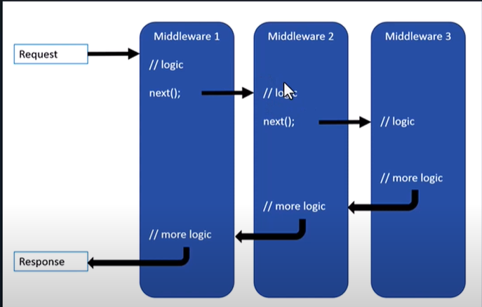
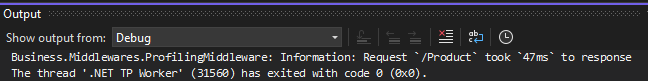
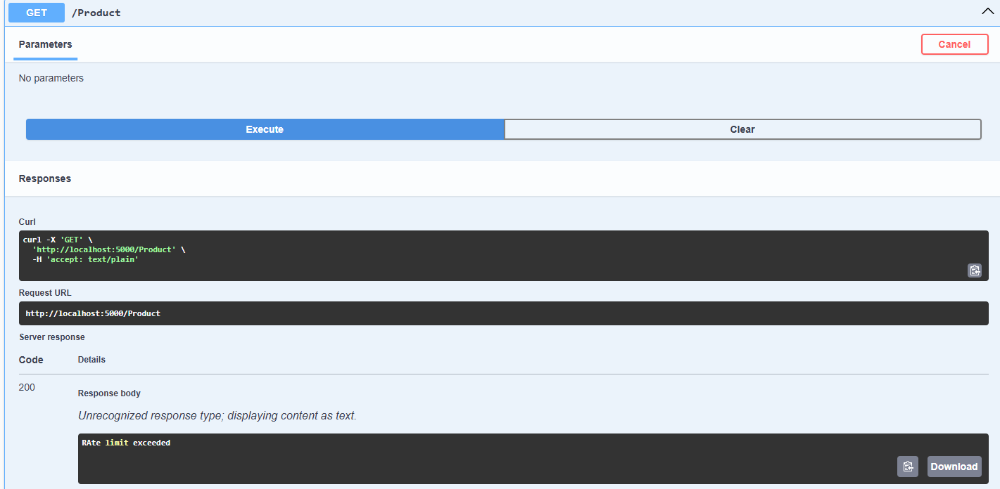

*(بواب البرنامج) مسؤول عن استقبال وارسال الطلبات والتعديل عليها في الدخول او الخروج*
# Summary:
### ✅ What is Middleware in ASP.NET Core?

**Middleware** in ASP.NET Core is a **component** in the request/response pipeline that:

- **Receives** HTTP requests,    
- **Does something** (like logging, authentication, routing, etc.),    
- Then **passes the request** to the next middleware (or ends the response).    

---

### 🔄 Think of middleware like a chain:

Each piece handles part of the request, one after the other.
```
[ Request ] → [ Middleware 1 ] → [ Middleware 2 ] → ... → [ Endpoint ]
                                                        ↓
                                          [ Response goes back the same way ]

```


---

### 🔧 Examples of built-in middleware:

- `UseRouting()` → Matches request to route.    
- `UseAuthentication()` → Checks if the user is logged in.    
- `UseAuthorization()` → Checks if the user has permission.    
- `UseEndpoints()` → Calls the controller/action.    

---

### 🧠 Custom middleware:

You can write your own to:

- Log requests    
- Handle errors globally    
- Modify requests/responses    

---

### ✅ In code (simple example):

```
app.Use(async (context, next) =>
{
    Console.WriteLine("Request coming in");
    await next(); // Call next middleware
    Console.WriteLine("Response going out");
});
```

---

### 📌 Summary in one line:

**Middleware is a building block in ASP.NET Core used to process HTTP requests and responses in a pipeline.**

|Concept|Description|
|---|---|
|What is middleware|Component that processes HTTP requests/responses|
|Purpose|Logging, authentication, error handling, etc.|
|Execution flow|Runs in order; can short-circuit or call the next middleware|
|Build it|Create a class with `Invoke` or `InvokeAsync`|
|Register it|`app.UseMiddleware<YourMiddleware>()`|

### ❓ Must a middleware class name end with `Middleware`?

🟢 **No — it is not required.**

The word **`Middleware`** at the end of the class name is just a **naming convention** to make it clear that the class is used in the middleware pipeline.

---

#### ✅ But it's strongly recommended because:

- **Readability**: Makes it easy to understand what the class does (`ExceptionMiddleware`, `LoggingMiddleware`, etc.).
    
- **Consistency**: Follows the common ASP.NET Core practices.
    
- **Discoverability**: When working in a large team or coming back later, you know what the class is used for immediately.

# 🛠️ How to Build a Custom Middleware (Step-by-Step)

### 1️⃣ Create the Middleware Class


```
public class MyCustomMiddleware
{
    private readonly RequestDelegate _next;

    public MyCustomMiddleware(RequestDelegate next)
    {
        _next = next;
    }

    public async Task Invoke(HttpContext context)
    {
        // Do something before the request
        Console.WriteLine("Before next middleware");

        await _next(context); // Call the next middleware

        // Do something after the request
        Console.WriteLine("After next middleware");
    }
}
```

---

### 2️⃣ Register Middleware in `Program.cs`
important note: The middleware order is very important, so before register it we should read the documentation of middleware and make sure if it has a specific order. If it not has a specific it will be better to put it in the end.

```
app.UseMiddleware<MyCustomMiddleware>();
```

> 📌 This adds it to the pipeline. Its position matters.

# Examples:

## Profiling Middleware:
This middleware for calculate the response time (there is a built in tools).
### Class:

```

using Microsoft.AspNetCore.Http;
using Microsoft.Extensions.Logging;
using System.Diagnostics;

namespace Business.Middlewares
{
    public class ProfilingMiddleware
    {
        private readonly RequestDelegate _next;
        private readonly ILogger<ProfilingMiddleware> _logger;

        // this ctor is a reference for the next middleware
        public ProfilingMiddleware(RequestDelegate next, ILogger<ProfilingMiddleware> logger)
        {
            _next = next;
            _logger = logger;
        }

        // HttpContext: This class has all the informations in the request and response 
        public async Task Invoke(HttpContext context)
        {
            var stopwatch = new Stopwatch();
            stopwatch.Start();
            await _next(context);
            _logger.LogInformation($"Request `{context.Request.Path}` took `{stopwatch.ElapsedMilliseconds}ms` to response");
        }
    }
}
```

### Registrations:
```
app.UseMiddleware<ProfileingMiddleware>();
```

### Results:



## Rate Limiting Middleware:
This middleware to put a limit for the number of requests (there is a built in tools):

### Class:
```

using Microsoft.AspNetCore.Http;

namespace Business.Middlewares
{
    internal class RateLimitingMiddleware
    {
        private readonly RequestDelegate _next;
        private static int _counter = 0;
        private static DateTime _lastRequestDate = DateTime.Now;
        public RateLimitingMiddleware(RequestDelegate next)
        {
            _next = next;
        }

        public async Task Invoke(HttpContext context)
        {
            _counter++;
            if(DateTime.Now.Subtract(_lastRequestDate).Seconds > 10)
            {
                _counter = 1;
                _lastRequestDate = DateTime.Now;
                await _next(context);
            }
            else
            {
                if (_counter > 5)
                {
                    _lastRequestDate = DateTime.Now;
                    await context.Response.WriteAsync("RAte limit exceeded");

                }
                else
                {
                    _lastRequestDate = DateTime.Now;
                    await _next(context);
                }

        }
    }
}
```

### Registration:
in this middleware the order is important because i want to avoid any internally requests like the swagger requests loading.

```
app.UseMiddleware<RateLimitingMiddleware>();
```
### Result:
after click 6 times on excute:



## Exceptions:
> u can find it here: [Pull Request 24](https://dev.azure.com/PalMazad/PalMazad/_git/PalMazadStore/pullrequest/24): Exceptions middleware

### 📌 Purpose

`ExceptionMiddleware` is a custom middleware that:
- Catches **all unhandled exceptions** globally    
- Logs them using `ILogger`    
- Returns a **consistent JSON response** with the correct HTTP status code    
- Hides stack traces in production for security    

---

### 🧩 Middleware Class Code

```
using Business.Infrastructure.Exceptions;
using Microsoft.AspNetCore.Http;
using Microsoft.Extensions.Logging;
using System.Text.Json;
using Microsoft.Extensions.Hosting;

namespace Business.Middlewares
{
    public class ExceptionMiddleware
    {
        private readonly RequestDelegate _next;
        private readonly ILogger<ExceptionMiddleware> _logger;
        private readonly IHostEnvironment _env;

        public ExceptionMiddleware(RequestDelegate next, ILogger<ExceptionMiddleware> logger, IHostEnvironment env)
        {
            _next = next;
            _logger = logger;
            _env = env;
        }

        public async Task InvokeAsync(HttpContext context)
        {
            try
            {
                await _next(context);
            }
            catch (Exception ex)
            {
                _logger.LogError(ex, ex.Message);
                await HandleExceptionAsync(context, ex);
            }
        }

        private async Task HandleExceptionAsync(HttpContext context, Exception exception)
        {
            context.Response.ContentType = "application/json";
            context.Response.StatusCode = exception switch
            {
                NotFoundException => StatusCodes.Status404NotFound,
                ArgumentException => StatusCodes.Status400BadRequest,
                _ => StatusCodes.Status500InternalServerError
            };

            var response = new
            {
                statusCode = context.Response.StatusCode,
                message = exception.Message,
                details = _env.IsDevelopment() ? exception.StackTrace : null
            };

            await context.Response.WriteAsync(JsonSerializer.Serialize(response));
        }
    }
}
```

---

### ⚙️ Middleware Flow (From Start to End)

1. **Request enters the ASP.NET pipeline**    
2. `ExceptionMiddleware` is triggered before other middlewares (e.g., Auth, Routing)    
3. It calls `_next(context)` to let the next middleware/controller run    
4. If an exception occurs in downstream code:    
    - It is caught inside `catch (Exception ex)        
    - Logged via `_logger.LogError(...)`        
    - Handled by `HandleExceptionAsync()`        
5. A JSON response is returned to the client with:    
    - `statusCode`: 404, 400, or 500        
    - `message`: exception message        
    - `details`: stack trace only if in development        

---

### 📝 JSON Error Format

Example response:

```
{
  "statusCode": 404,
  "message": "Product with ID '1234' was not found.",
  "details": "Stack trace if in development"
}
```

---

### 🔌 Register the Middleware

In `Program.cs`, register it early:

```
app.UseMiddleware<ExceptionMiddleware>();
```

> Place this **before** `UseAuthorization()` and `MapControllers()`.

---

### ✅ Summary of Benefits

|Feature|Benefit|
|---|---|
|Global Handling|No need for try/catch in controllers|
|Logging|All exceptions are logged in one place|
|Clean Controllers|Business logic stays focused|
|Consistent Response|Frontend gets uniform error JSON|
|Secure|Stack traces shown only in development|

---


