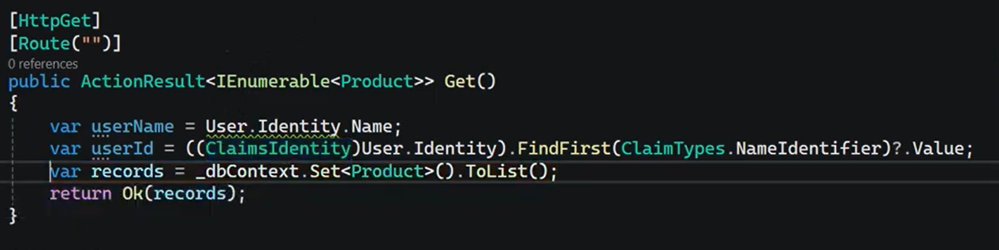
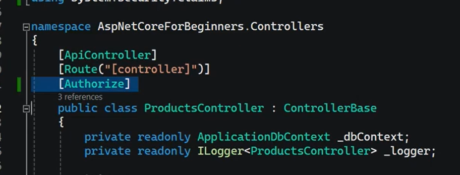

## ✅ Summary: Controller with Basic Authentication

In ASP.NET Core, when using **Basic Authentication**, you typically create controllers that are protected using the `[Authorize]` attribute with a specified **authentication scheme name**.


### 🔐 Key Point:

You must **explicitly specify** the authentication scheme you registered (e.g., `"Basic"`) using:
```
[Authorize(AuthenticationSchemes = "Basic")]

```


### 📦 Example:

```
[ApiController]
[Route("api/[controller]")]
public class SecureController : ControllerBase
{
    // This action requires Basic Authentication
    [HttpGet("data")]
    [Authorize]
    public IActionResult GetSecureData()
    {
        var username = User.Identity?.Name; // From the authenticated claims
        return Ok($"Hello {username}, this is your secure data.");
    }

    // This action is open to everyone
    [HttpGet("public")]
    [AllowAnonymous]
    public IActionResult GetPublicData()
    {
        return Ok("This is public data. No authentication required.");
    }
}

```

### 🔍 What Happens Here:

- ✅ **`GetSecureData`**:
    
    - Requires valid Basic Auth credentials in the `Authorization` header.        
    - Will be authenticated by your custom `BasicAuthenticationHandler`.        
    - Returns a personalized message using the authenticated user's name.
        
- ❌ **`GetPublicData`**:
    
    - Accessible to everyone, even unauthenticated users.        
    - Marked with `[AllowAnonymous]` to override the `[Authorize]` requirement.        

---

### 🧠 Tips:

- The controller must work with `app.UseAuthentication()` and `app.UseAuthorization()` in the middleware pipeline.    
- Use `User.Identity?.Name` to access the authenticated user's identity.    
- You can also add **roles or claims** in the handler for role-based authorization if needed.

if i need to access on the username or id: 



we can make the authorize on all the controller instead of make it by each endpoint like: 

