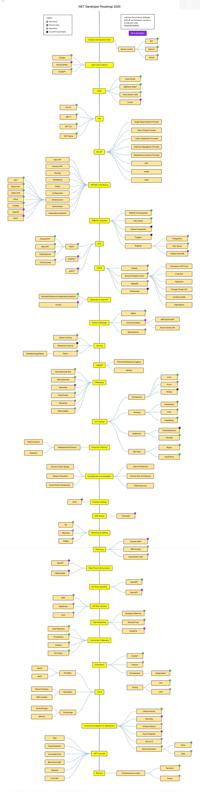

# 📘 .NET Learning Documentation

Welcome! 👋  
This repository contains notes, code snippets, and references focused on learning the **core concepts and fundamentals of .NET**.

> 📌 Note: This is for **learning and experimentation purposes only**. Code and explanations are simplified for clarity.

> 📌 Note: This Repository is Best Edited and Viewed Using [https://obsidian.md/](https://obsidian.md/)

---

## 🎯 Purpose

The goal of this documentation is to:

- Understand and explore essential **.NET concepts**.
- Learn by combining **official resources**, **community content**, and **hands-on code snippets**.
- Serve as a personal **learning companion** or a **quick reference** for future projects.

---

## 📚 What's Included

- Concept summaries (e.g., Authorization, Dependency Injection, Middleware)
- Code examples and usage patterns
- Links to helpful online documentation and tools
- Markdown-based notes and walkthroughs

## 📁Related Projects:

- PalMazad Project: https://github.com/MohammadDarAbed/PalMazad
- Authentication Project: https://github.com/MohammadDarAbed/Authentication

---
# ✅ Topics Covered (WIP ⏳)

